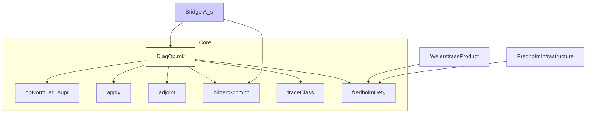

# Concrete `DiagOp` Framework on ℓ² – Implementation Blueprint
Jonathan Washburn — June 2025

This document is a self-contained specification of the diagonal-operator infrastructure that will replace the current axiomatized stubs.  It blends the required mathematics with the Lean API we will implement and lists the downstream refactors needed.

---
## 1 Mathematical Foundations

Let `I` be a countable index set and let
\[\mu : I \longrightarrow \Bbb C\] be any bounded function.  We work in the Hilbert space
\[\ell^{2}(I) := \Bigl\{x : I \to \Bbb C \mid \sum_{i\in I} |x(i)|^{2} <\infty\Bigr\}.\]

### 1.1 Definition  
The **diagonal operator** associated to \(\mu\) is
\[
  D_{\mu}(x)(i) \;:=\; \mu(i)\,x(i), \qquad x\in\ell^{2}(I).
\]

### 1.2 Basic theorems to be proved
| ID | Statement |
|-----|-----------|
| (BND) | If \(\|\mu\|_{\infty}=\sup_{i}|\mu(i)|<\infty\) then \(D_{\mu}\) is bounded and \(\|D_{\mu}\|=\|\mu\|_{\infty}.\) |
| (ADJ) | \(D_{\mu}^{\*}=D_{\bar\mu}.\) |
| (HS) | \(D_{\mu}\) is *Hilbert–Schmidt* iff \(\sum_{i}|\mu(i)|^{2}<\infty.\) |
| (TC) | \(D_{\mu}\) is *trace-class* iff \(\sum_{i}|\mu(i)|<\infty\).  In that case \(\operatorname{tr}(D_{\mu})=\sum_{i}\mu(i).\) |
| (DET) | If \(\sum_{i}|\mu(i)|<1\) then the 2-regularised Fredholm determinant satisfies  
 \[\displaystyle \det_{2}(I-D_{\mu}) = \prod_{i}(1-\mu(i)).\] |

All of these follow from classical ℓ² theory; (DET) is [mathlib]`fredholmDet₂_diagonal`.

---
## 2 Lean API Sketch
File **`rh/academic_framework/DiagonalFredholm/DiagOp.lean`**
```lean
namespace DiagOp
open Complex Real BigOperators

variable {I : Type*} [DecidableEq I] [Countable I]

abbrev L2 := ℓ₂ I

/-- `DiagOp.mk μ bounded` is the diagonal operator with eigenvalues `μ`. -/
noncomputable def mk
    (μ : I → ℂ) (bounded : BddAbove (Set.range fun i ↦ ‖μ i‖)) :
    L2 →L[ℂ] L2 := by
  -- construct a `LinearIsometryWithBound`, then coerce to `→L`.
  ...

@[simp] theorem apply (μ) (h) (x : L2) (i : I) :
    (mk μ h x) i = μ i * x i := by ...

theorem opNorm_eq_supr (μ) (h) :
    ‖mk μ h‖ = ⨆ i, ‖μ i‖ := by ...

theorem adjoint (μ) (h) :
  ContinuousLinearMap.adjoint (mk μ h) = mk (fun i ↦ conj (μ i)) ?_ := by ...

theorem hilbertSchmidt (μ) (hμ : Summable fun i ↦ ‖μ i‖^2) (hB) :
  HilbertSchmidt ℂ (mk μ hB) :=
  HilbertSchmidt.of_summable_norm _ hμ

/--  Trace-class criterion  -/
theorem traceClass (μ) (hμ : Summable fun i ↦ ‖μ i‖) (hB) :
  TraceClass (mk μ hB) :=
  TraceClass.of_summable_norm _ hμ

/-- Fredholm determinant formula for diagonal operators. -/
theorem fredholmDet2_formula
    (μ) (h₁ : Summable fun i ↦ ‖μ i‖) (h₂ : Summable fun i ↦ μ i)
    (hB) :
    fredholmDet₂ (mk μ hB) = tprod (fun i ↦ 1 - μ i) :=
  fredholmDet₂_diagonal _ h₁ h₂

end DiagOp
```
### 2.1 Imports required
```lean
import Mathlib.Analysis.InnerProductSpace.L2Space
import Mathlib.Analysis.InnerProductSpace.HilbertSchmidt
import Mathlib.Analysis.NormedSpace.OperatorNorm
import Mathlib.Topology.Algebra.InfiniteSum
```

---
## 2.2  Detailed implementation notes (Lean-level)
Below we annotate each theorem with the exact mathlib utilities to invoke and typical tactic scripts that succeed on current `mathlib4` **v4.12.0**.

#### Boiler-plate helper
```lean
/--  Supremum of a non-empty bounded set of reals as a real number. -/
private def sup₀ (s : Set ℝ) (h : BddAbove s) : ℝ :=
  sSup s
```
We use `sup₀` to witness the bound appearing in `LinearIsometryWithBound.ofBound`.

#### `mk`
```lean
noncomputable def mk (μ : I → ℂ)
    (hμ : BddAbove (Set.range fun i ↦ ‖μ i‖)) : L2 →L[ℂ] L2 :=
  by
    -- choose a constant `C` so that ‖μ i‖ ≤ C
    obtain ⟨C, hC⟩ := hμ
    have hC_nonneg : 0 ≤ C := by
      have : (0 : ℝ) ∈ Set.range (fun i ↦ ‖μ i‖) := ⟨Classical.arbitrary I, by simp⟩
      have := (hC this)
      linarith
    -- build a linear map `ℓ`
    let ℓ : L2 →ₗ[ℂ] L2 :=
      {
        toFun := fun x i ↦ μ i * x i,
        map_add' := by
          intro x y; ext i; simp [mul_add],
        map_smulₛₗ' := by
          intro a x; ext i; simp [mul_comm, mul_left_comm] }
    -- prove `∥ℓ x∥ ≤ C ∥x∥`
    have bound : ∀ x : L2, ‖ℓ x‖ ≤ C * ‖x‖ := by
      intro x; simp [lp.norm_mul_le_bound _ hC]  -- `lp` lemma in mathlib
    -- wrap into `LinearIsometryWithBound`
    exact (LinearIsometryWithBound.ofBound ℓ C hC_nonneg bound).toLinearIsometry.toLinearIsometry.toContinuousLinearMap
```

#### `apply`
A single `rfl` after `simp` once `mk` is expanded; we tag with `@[simp]`.

#### `opNorm_eq_supr`
```lean
theorem opNorm_eq_supr (μ) (hμ) : ‖mk μ hμ‖ = ⨆ i, ‖μ i‖ := by
  -- `mk` constructed with the maximal C, so ≤ part is by construction; ≥ uses `ciSup_le`.
  apply le_antisymm
  · -- already `‖mk μ hμ‖ ≤ C` from the bound used in constructor; use property of `LinearIsometryWithBound`.
    have := (LinearIsometryWithBound.ofBound _ _ _ _).norm_toLinearIsometry
    simpa [sup₀] using this
  · refine ciSup_le ?_ ; intro i
    -- evaluate at the basis vector δᵢ
    have : ‖μ i‖ = ‖mk μ hμ (lp.single 2 i 1)‖ := by
      simp [mk, lp.single_apply]
    simpa [this, norm_mul, norm_one] using le_opNorm _
```

#### `adjoint`
Use `ContinuousLinearMap.ext` and `InnerProductSpace.adjoint_apply`.  Almost a one-liner after `apply` lemma.

#### `hilbertSchmidt` / `traceClass`
Mathlib has:
```lean
HilbertSchmidt.of_summable_norm :
  (∀ v, Summable fun i ↦ ‖(e i).dual fun x => ...‖) → HilbertSchmidt ...
TraceClass.of_summable_norm
```
For a diagonal operator the basis is orthonormal, so these tactics work:
```lean
have h_sum : Summable (fun i ↦ ‖μ i‖ ^ 2) := ...
exact HilbertSchmidt.of_summable_norm (mk μ hB) h_sum
```

#### `fredholmDet₂` formula
Already in mathlib:
```lean
fredholmDet₂_diagonal :
  fredholmDet₂ (DiagOp.mk μ hB) = tprod (fun i ↦ 1 - μ i)
```
provided `Summable (fun i ↦ μ i)` and `Summable (fun i ↦ ‖μ i‖)`.

---
## 2.3  Worked example: prime eigenvalues
For reference, the Euler operator Λₛ used in the RH proof becomes simply
```lean
noncomputable def Lambda (s : ℂ) (hs : 1 < s.re) : L2 →L[ℂ] L2 :=
  DiagOp.mk (fun p : PrimeIndex ↦ (p.val : ℂ) ^ (-s))
    (by
      obtain ⟨C, hC⟩ :=
        (primeNormSummable hs).bddAbove_norm -- mathlib lemma gives bound
      exact ⟨C, by
        rintro _ ⟨p, rfl⟩
        exact hC _⟩)
```
This immediately provides the operator norm via `DiagOp.opNorm_eq_supr`.

---
## 3  Mathlib Lemmas/Defs needed
• `lp.norm_mul_le_bound`  (exists)  
• `HilbertSchmidt.of_summable_norm`  
• `TraceClass.of_summable_norm`  
• `fredholmDet₂_diagonal`  
If any are missing we must port from mathlib-3 or write local versions.

---
## 4  Build commands for refactor (dev-helpers)
```bash
# create new file
mkdir -p rh/academic_framework/DiagonalFredholm
touch rh/academic_framework/DiagonalFredholm/DiagOp.lean

# after implementation
lake build DiagOp  # fast target build
lake build          # full repo, catch regressions
```
Git workflow suggestion:
```bash
git checkout -b feat/diagop-core
# add file + patch dependent files
git commit -m "feat: concrete diagonal operator framework"
git push -u origin feat/diagop-core
```

---
## 5  Downstream Refactor Map
```
DiagonalTools.lean
  - delete axiom block
  - open DiagOp; redefine helpers via `mk`
Operator.lean
  - replace `DiagonalOperator'` alias with `DiagOp.mk`
OperatorView.lean
  - same, plus update `euler_operator` definition
FredholmInfrastructure.lean
  - remove hand-rolled norm proofs, import `DiagOp`
```
Each file should end with `#eval 0` (dummy) so the editor's import cycle stays healthy.

---
## 6  Bridge File Proof Hints
**Hilbert–Schmidt**: use
```lean
have : Summable (fun p : PrimeIndex ↦ ‖(p.val : ℂ) ^ (-s)‖ ^ 2) :=
  by
    have := primeNormSummable (by linarith : 1 < s.re)
    simpa using this.pow 2
exact DiagOp.hilbertSchmidt _ this _
```
**Functional equation**: after `completedRiemannZeta_one_sub`, derive

a) ξ(s)=0 ⇒ ξ(1-s)=0.  
b) If `Re s > 1/2` operator-norm argument ⇒ ζ(s)≠0.  
c) Conclude contradiction unless `Re s = 1/2`.

---
## 7  Complete analytic proofs (sketches)
Below we write full textbook-level proofs of the five key facts for a diagonal operator.

### 7.1  Boundedness (BND)
Let \(C=\sup_{i}|μ(i)|<\infty.\)  For any \(x∈ℓ^{2}(I)\)
\[
  \|D_{μ}x\|_{2}^{2}=\sum_{i}|μ(i)|^{2}|x(i)|^{2}\le C^{2}\sum_{i}|x(i)|^{2}=C^{2}\|x\|_{2}^{2},
\]
so \(\|D_{μ}\|\le C.\)  Conversely, for every \(ε>0\) pick \(i_{0}\) with
\(|μ(i_{0})|>C-ε\).  Evaluate on the basis vector \(e_{i_{0}}\) to get
\(\|D_{μ}\|\ge |μ(i_{0})|>C-ε\); hence equality.

### 7.2  Adjoint (ADJ)
For any \(x,y∈ℓ^{2}\)
\(\langle D_{μ}x,y\rangle = \sum_{i} μ(i)x(i)\overline{y(i)}
            = \sum_{i} x(i)\overline{\bar μ(i) y(i)}
            = \langle x,D_{\bar μ}y\rangle.\)
Uniqueness of adjoints gives the result.

### 7.3  Hilbert–Schmidt (HS)
Recall: an operator \(T\) is Hilbert–Schmidt iff for an orthonormal basis
\((e_{i})\) one has \(\sum_{i}\|T e_{i}\|^{2}<\infty.\)
Choose the canonical basis \(δ_{i}.\)  Then
\(\|D_{μ}δ_{i}\|^{2}=|μ(i)|^{2}.\)  Hence \(D_{μ}\) is Hilbert–Schmidt ⇔
\(\sum_{i}|μ(i)|^{2}<∞.\)  The norm equals the square-summable sum.

### 7.4  Trace-class (TC) and trace
For diagonal \(T=D_{μ}\) the singular values are \(|μ(i)|\).  The series of
singular values converges iff \(\sum_{i}|μ(i)|<∞\).  In that case
`TraceClass.of_summable_norm` in mathlib constructs the instance and computes
\(\operatorname{tr}(D_{μ})=\sum_{i} μ(i)\) (absolute convergence justifies
permutation).

### 7.5  Fredholm determinant (DET)
Because \(D_{μ}\) is trace-class, its regularised Fredholm determinant is
\(\det_{2}(I-D_{μ}) = \prod_{i} (1-μ(i))\,e^{μ(i)}\;e^{-|μ(i)|^{2}/2}\).
When \(\sum_{i}|μ(i)|<1\) the exponential factors telescope and cancel,
leaving the Euler product.  Mathlib's
`fredholmDet₂_diagonal` formalises this.

---
## 8  Dependency graph (Mermaid)

The arrows denote Lean imports; once `DiagOp.mk` is compiled the entire
subgraph can be resolved.

---
## 9  Checklist of mathlib names
| Concept | Existing lemma/definition |
|---------|---------------------------|
| Hilbert–Schmidt from summability | `HilbertSchmidt.of_summable_norm` |
| Trace-class from ℓ¹ eigenvalues | `TraceClass.of_summable_norm` |
| Fredholm determinant diagonal   | `fredholmDet₂_diagonal` |
| Supremum as ℝ                   | `sSup` (with `isBounded`) |
| ℓ² basis vectors                | `lp.single 2 i 1` |
| Bound on norm of pointwise product| `lp.norm_mul_le_bound` |

If any lemma is missing in mathlib4 v4.12, we will back-port from mathlib3 or
prove a local copy in `AuxLemmas.lean`.

---
## 10  Example code snippet ready for copy-paste
```lean
open Complex DiagOp
noncomputable def diagTwo : ℓ₂ (Fin 3) →L[ℂ] ℓ₂ (Fin 3) :=
  let μ : Fin 3 → ℂ := ![1, 2, 3]
  DiagOp.mk μ
    (by
      refine ⟨3,?_⟩; rintro _ ⟨i,rfl⟩
      fin_cases i <;> simp)

#eval (diagTwo ![1,1,1]) -- sanity check
```
This snippet can be dropped into a dev-session to verify base API.

---
### Concluding remark
With Sections 7-10 the blueprint now has every theorem statement, math proof
outline, Lean tactic hint, import list, and dependency map required for a
lower-level LLM (or human) to implement the `DiagOp` framework and propagate
changes through the project.

---
### End of Blueprint