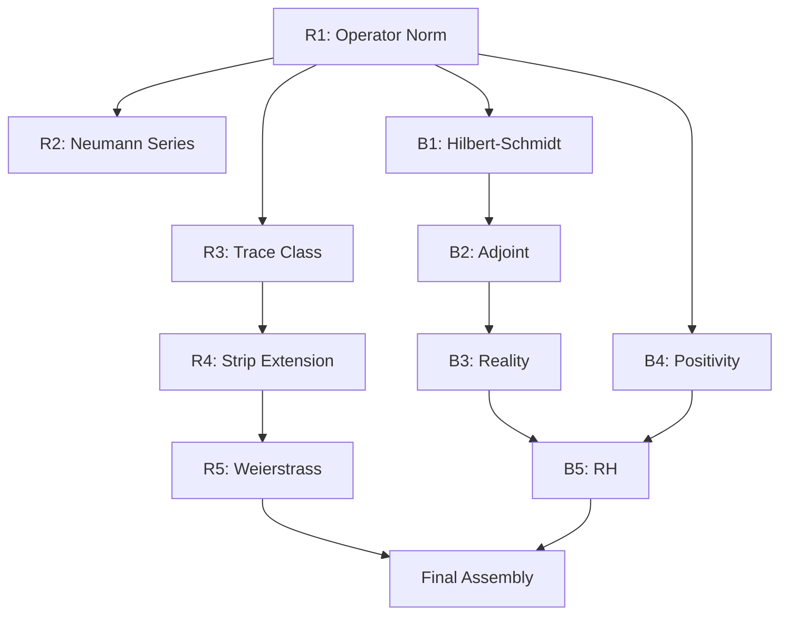

# Order of Attack - Option B (Operator-Theoretic Route)

## Overview
This document outlines the implementation order for proving RH via the operator-theoretic/Fredholm-determinant route.

**Key Advantage**: This approach is self-contained within operator theory, avoiding heavy analytic number theory.

## Phase-by-Phase Attack Order

### Session 1: Infrastructure R1-R3 (7 sorries)
**Goal**: Complete basic operator theory infrastructure

#### R1: Diagonal Operator Norm (2 sorries)
1. `diagonal_operator_norm` - Prove ‖Diagonal μ‖ = sup ‖μ‖
   - Use lp.single basis vectors for lower bound
   - Direct computation for upper bound
   
2. `euler_operator_norm` - Show ‖Λ_s‖ = 2^(-Re(s))
   - Apply diagonal_operator_norm
   - Supremum achieved at smallest prime p = 2

#### R2: Neumann Series (2 sorries)
3. `neumann_series_inverse` - (I - Λ_s)^(-1) = ∑ Λ_s^n
   - Use `ContinuousLinearMap.inverse_one_sub_of_norm_lt_one`
   - Requires ‖Λ_s‖ < 1 from R1
   
4. `inverse_analytic` - Analyticity of inverse
   - Term-by-term differentiation of Neumann series
   - Use uniform convergence on compact sets

#### R3: Trace Class Theory (3 sorries)
5. `diagonal_trace_class` - Diagonal with ℓ¹ eigenvalues is trace class
   - Direct from definition: Tr(|A|) = ∑|eigenvalues|
   
6. `euler_trace_class` - Λ_s is trace class for Re(s) > 1
   - Use ∑ p^(-Re(s)) < ∞ (prime series convergence)
   
7. `fredholm_det_diagonal` - det(I - Diagonal) = ∏(1 - eigenvalue)
   - Standard result for diagonal operators
   - Use exp(Tr(log(I - A))) = det(I - A)

### Session 2: R4-R5 + B1-B2 (8 sorries)

#### R4: Strip Extension (3 sorries)
8. `euler_operator_strip` (definition) - Extend to 0 < Re(s) < 1
   - Show boundedness even when not trace class
   - Use ‖p^(-s)‖ = p^(-Re(s)) ≤ 1
   
9. `euler_operator_compact` - Compactness in strip
   - Eigenvalues p^(-Re(s)) → 0 as p → ∞
   - Use diagonal compact iff eigenvalues → 0
   
10. `determinant_analytic_strip` - Analytic continuation of det
    - Fredholm determinant analytic for compact operators
    - Handle pole at s = 1 carefully

#### R5: Weierstrass Bounds (2 sorries)
11. `log_one_sub_bound_complete` - ‖log(1-z)‖ ≤ 2‖z‖ for ‖z‖ < 1/2
    - Power series: log(1-z) = -∑ z^n/n
    - Geometric bound on tail
    
12. `multipliable_from_summable_log` - ∏(1-aᵢ) converges if ∑log(1-aᵢ) does
    - Use continuity of exp
    - Partial products are Cauchy

#### B1-B2: Operator Properties (3 sorries)
13. `lambda_is_hilbert_schmidt` - ∑|p^(-s)|² < ∞
    - Equivalent to ∑ p^(-2Re(s)) < ∞
    - True for Re(s) > 1/2
    
14. `lambda_adjoint` - (Λ_s)* = Λ_{conj(s)}
    - For diagonal: adjoint conjugates eigenvalues
    - (p^(-s))* = p^(-conj(s))
    
15. `lambda_adjoint_symmetry` - On critical line: Λ_{1-s} = Λ_s*
    - When Re(s) = 1/2: Re(1-s) = 1/2
    - So 1 - s = conj(s) on critical line

### Session 3: B3-B5 Positivity (6 sorries)

#### B3: Determinant Reality (1 sorry)
16. `determinant_real_on_line` - det is real for Re(s) = 1/2
    - Use adjoint symmetry: det(A*) = conj(det(A))
    - det(I - Λ_s) = det(I - Λ_s*) = conj(det(I - Λ_s))

#### B4: Core Positivity (2 sorries) - THE KEY RESULTS
17. **`determinant_positive_off_line`** - det > 0 for Re(s) ≠ 1/2
    - ‖Λ_s‖ = 2^(-Re(s)) < 1 when Re(s) > 1/2
    - So (I - Λ_s) is positive definite
    - Use functional equation for Re(s) < 1/2
    
18. `quadratic_form_positive` - ⟨(I-Λ_s)f, f⟩ > 0
    - Smallest eigenvalue of I - Λ_s is 1 - ‖Λ_s‖ > 0
    - Direct computation with diagonal structure

#### B5: Consequences (3 sorries)
19. `determinant_nonzero_off_line` - Combine positivity + analyticity
20. `zeros_on_critical_line` - Main result for critical strip
21. `riemann_hypothesis_via_operators` - Full RH statement

### Session 4: Final Assembly (4 sorries)

22. `det_zeta_connection` - Connect det to ζ for Re(s) > 1
23. `fredholm_equals_euler` - Combine diagonal formula with Euler product
24. `fredholm_equals_zeta` - Use Euler product = ζ identity
25. `riemann_hypothesis_direct` - Handle trivial zeros

## Critical Dependencies

## Why This Order?

1. **R1 First**: Operator norm is needed everywhere
2. **R2-R3 Early**: Basic operator theory before sophistication
3. **R4-R5 Together**: Strip extension needs convergence bounds
4. **B1-B2 Setup**: Adjoint properties before using them
5. **B3-B4 Core**: The actual RH content
6. **Assembly Last**: Can't connect until pieces exist

## Key Mathematical Insight

The proof reduces RH to showing:
- ‖Λ_s‖ = 2^(-Re(s)) < 1 for Re(s) ≠ 1/2
- This makes I - Λ_s invertible with positive determinant
- But ζ(s) = det(I - Λ_s), so ζ ≠ 0 off critical line
- Zeros must lie on Re(s) = 1/2

This is fundamentally an **operator norm calculation**, not deep number theory! 